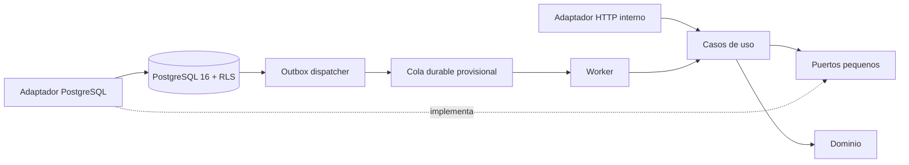
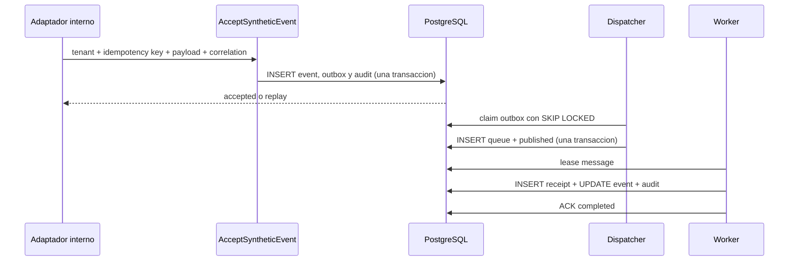

# Arquitectura de Iteracion 1

Esta implementacion materializa el walking skeleton autorizado por
`Architecture Baseline v1`: un monolito modular, una base PostgreSQL y procesos
API/worker desplegables por separado. El
[Implementation Readiness Check](implementation-readiness.md) registra el
veredicto, alcance y decisiones provisionales recibidas.

## Modulos y limites

`modules/tenancy` posee `TenantId` y las reglas minimas de Tenant. El modulo
`modules/synthetic_events` posee payload, idempotencia, estados, comandos, casos
de uso y puertos de persistencia. `modules/lead_qualification` posee el perfil
comercial, oportunidades telecom, senales, politicas versionadas y el motor
determinista de la Entrega 1. `modules/telecom_extraction` posee la preparacion de
contexto, salida estructurada, confianza, contradicciones y mapeo de la Entrega 2;
su adaptador OpenAI queda detras de un puerto y es opt-in. Ningun dominio importa
FastAPI, SQLAlchemy, Pydantic Settings, Prometheus o SDKs de IA.

`infrastructure` implementa los puertos con PostgreSQL y contiene mecanismos
tecnicos compartidos: engines, tablas, outbox, cola, leases e inbox.
`entrypoints` traduce HTTP/proceso a casos de uso. `bootstrap.py` es la unica
raiz de composicion.

## Flujo vertical

El efecto y el ACK son transacciones distintas. Si ocurre una caida despues del
efecto, el lease expira y el mismo mensaje vuelve a entregarse; la clave primaria
del receipt convierte la segunda ejecucion en no-op y permite completar el ACK.

## Multiempresa

- Toda tabla empresarial contiene `tenant_id`; `tenants.id` cumple ese papel en
  la raiz.
- Los IDs tenant-scoped usan clave primaria compuesta `(tenant_id, id)`.
- Repositorios y updates siempre reciben y filtran tenant de forma obligatoria.
- Cada transaccion runtime establece `app.current_tenant_id` localmente.
- PostgreSQL aplica `ENABLE` y `FORCE ROW LEVEL SECURITY` con `USING` y
  `WITH CHECK` en las seis tablas.
- Unicidad de idempotencia y relaciones outbox/queue incluyen `tenant_id`.
- La API usa `app_runtime NOBYPASSRLS`; el worker usa una credencial separada.

El worker necesita descubrir trabajo de todos los tenants y provisionalmente usa
`BYPASSRLS`. Incluso con ese privilegio, cada lectura y escritura incluye
predicados tenant-scoped. La deuda y condicion de retiro estan documentadas.

## Reglas de dependencia

Permitidas:

- entrypoints -> aplicacion, dominio, composicion y observabilidad;
- aplicacion -> dominio y puertos;
- infraestructura -> puertos, dominio y librerias tecnicas;
- dominio -> biblioteca estandar y errores independientes de transporte.

Prohibidas:

- dominio -> FastAPI, SQLAlchemy, configuracion o proveedores;
- aplicacion -> tablas SQL, HTTP o variables de entorno;
- un modulo de negocio -> tablas internas de otro modulo;
- repositorios empresariales con tenant opcional o consultas globales runtime.

Un modulo nuevo debe representar una capacidad aprobada, declarar su propietario
de datos y exponer casos de uso antes de agregar adaptadores. No se crean
directorios ni contratos para capacidades futuras.

La calificacion de leads es por ahora un modulo puro sin tablas ni endpoint. La
politica se resuelve mediante un puerto por tenant y oportunidad; el motor
verifica nuevamente ese alcance. Consulta
[Telecommunications Lead Qualification](telecommunications-lead-qualification.md)
y el [analisis de impacto](lead-qualification-impact-analysis.md). La extraccion
estructurada tampoco agrega tablas/endpoints; consulta
[Telecommunications AI Structured Extraction](telecommunications-ai-structured-extraction.md)
y su [analisis de impacto](delivery-2-impact-analysis.md).

## Transacciones

- Aceptacion: valida tenant activo e inserta evento, auditoria y outbox.
- Dispatch: bloquea un lote, inserta mensaje y marca outbox publicado.
- Claim: crea un lease corto y aumenta intentos.
- Efecto: bloquea evento, valida hashes, inserta receipt, actualiza estado y audita.
- ACK/retry: completa o libera/dead-letter el mensaje sin guardar texto sensible.

## Operacion y observabilidad

Los procesos emiten JSON con environment, service, module, request/correlation y
tenant cuando existen. Los payloads no se registran. Prometheus evita etiquetas
por tenant para controlar cardinalidad. API expone liveness/readiness; una falla
de PostgreSQL afecta readiness, no liveness.

## Decisiones vigentes

La arquitectura aplica monolito modular, PostgreSQL compartido, aislamiento RLS,
UUIDv7, outbox/inbox, idempotencia y observabilidad estructurada. El stack Python
y la cola local siguen provisionales hasta resolver B-05/B-06 de forma definitiva.
Consulta el [registro de ADRs](../adr/README.md).
